# DAX Bench Solver v0.8 (Public Beta)

**An iterative DAX problem-solving skill for Claude Code that measures what really matters: can your AI solve the problem?**

```
   ____    _   __  __   ____                  _       ____        _
  |  _ \  / \  \ \/ /  | __ )  ___ _ __   ___| |__   / ___|  ___ | |_   _____ _ __
  | | | |/ _ \  \  /   |  _ \ / _ \ '_ \ / __| '_ \  \___ \ / _ \| \ \ / / _ \ '__|
  | |_| / ___ \ /  \   | |_) |  __/ | | | (__| | | |  ___) | (_) | |\ V /  __/ |
  |____/_/   \_/_/\_\  |____/ \___|_| |_|\___|_| |_| |____/ \___/|_| \_/ \___|_|
                                                                            v0.8
```

## Authors & Credits

- **Inspectah DAX** ([Brian Julius](https://www.linkedin.com/in/brianjuliusdc/)) - Primary Author
- **AI ODB** (Claude Code) - AI Co-Author
- **Data Cat** (Keely) - Assistant & Testing

### Special Thanks

- **[Maxim Anatsko](https://www.maxanatsko.com/)** ([@maxanatsko](https://github.com/maxanatsko)) - Creator of the [Power BI MCP Server](https://github.com/pbi-tools/powerbi-mcp) used for runtime DAX validation, and the original [DAX Bench](https://daxbench.com) benchmark that establishes initial-shot performance baselines.

---

## What is DAX Bench Solver?

DAX Bench Solver extends the original DAX Bench concept to provide a **comprehensive view of AI model DAX capabilities**:

| Metric              | DAX Bench (Original) | DAX Bench Solver          |
| ------------------- | -------------------- | ------------------------- |
| Initial accuracy    | Yes                  | Yes                       |
| Iterative solving   | No                   | Yes (up to 10 iterations) |
| Cost tracking       | No                   | Yes (per-token, per-task) |
| Live validation     | Pattern matching     | Power BI execution        |
| Function validation | No                   | Yes (DAX.guide reference) |
| Error feedback      | No                   | Blind feedback loop       |
| Memory/Learning     | No                   | Yes (lessons-learned.md)  |
| Model comparison    | Single model         | Multi-model races         |

### Key Insight

> **Any decent LLM can solve DAX problems through iteration** - the question is how many tries it takes. With validated execution feedback, even smaller/cheaper models reach correct answers. The difference is efficiency.

### The Power of Memory

In real-world usage (Assisted Mode), DAX Bench Solver automatically captures lessons learned from problems requiring multiple iterations. **The system gets smarter over time**, learning:

- Common failure patterns and how to avoid them
- Effective feedback strategies that work
- Model-specific quirks and workarounds
- Task categories that need special handling

---

## Architecture & Workflow

### High-Level Architecture

```mermaid
flowchart TB
    subgraph Input["📥 Input"]
        USER[User Request]
        TASK[Task Definition]
        SCHEMA[Live PBI Schema]
    end

    subgraph Core["🧠 DAX Bench Solver Core"]
        INIT[Initialize]
        MEMORY[Memory File<br/>lessons-learned.md]
        MODELS[Model Cache<br/>OpenRouter]

        subgraph Loop["🔄 Solve Loop"]
            LLM[Call LLM]
            PARSE[Parse DAX]
            VALIDATE[Validate]
            FEEDBACK[Generate Feedback]
        end
    end

    subgraph Validation["✅ 3-Stage Validation"]
        V1[1. Syntax Check]
        V2[2. Function Check]
        V3[3. Runtime Check]
    end

    subgraph Output["📤 Output"]
        RESULT[Result & Metrics]
        LESSONS[Updated Lessons]
        REPORT[Comparison Report]
    end

    USER --> INIT
    INIT --> MEMORY
    INIT --> MODELS
    INIT --> SCHEMA
    TASK --> Loop
    SCHEMA --> Loop

    LLM --> PARSE
    PARSE --> V1
    V1 -->|Pass| V2
    V1 -->|Fail| FEEDBACK
    V2 -->|Pass| V3
    V2 -->|Fail| FEEDBACK
    V3 -->|Pass| RESULT
    V3 -->|Fail| FEEDBACK
    FEEDBACK --> LLM

    RESULT --> LESSONS
    RESULT --> REPORT
    MEMORY -.->|Read| LLM
    LESSONS -.->|Write| MEMORY
```



### The Solve Loop (Detailed)

```mermaid
flowchart LR
    subgraph Iteration["For Each Iteration (max 10)"]
        direction TB

        A[Call OpenRouter API] --> B[Extract DAX from Response]
        B --> C{Syntax Valid?}
        C -->|No| D[Syntax Error Feedback]
        C -->|Yes| E{Functions Valid?}
        E -->|No| F[Function Error Feedback]
        E -->|Yes| G[Create Measure in PBI]
        G --> H{Execution OK?}
        H -->|No| I[Runtime Error Feedback]
        H -->|Yes| J[Execute & Get Value]
        J --> K{Value Correct?}
        K -->|No| L[Value Mismatch Feedback]
        K -->|Yes| M[✅ SOLVED]

        D --> A
        F --> A
        I --> A
        L --> A
    end

    style M fill:#22c55e,color:#fff
    style D fill:#ef4444,color:#fff
    style F fill:#ef4444,color:#fff
    style I fill:#ef4444,color:#fff
    style L fill:#f59e0b,color:#fff
```



### Three-Stage Validation Pipeline

```mermaid
flowchart TB
    subgraph Stage1["Stage 1: Syntax Validation"]
        S1A[Parse DAX Expression]
        S1B[Check Parentheses Balance]
        S1C[Validate Measure Format]
        S1A --> S1B --> S1C
    end

    subgraph Stage2["Stage 2: Function Validation"]
        S2A[Extract Function Names]
        S2B[Check Against DAX.guide List]
        S2C[Flag Deprecated Functions<br/>EARLIER, EARLIEST]
        S2D[Flag Invalid Functions<br/>SUMIF, VLOOKUP, DENSE_RANK]
        S2A --> S2B --> S2C --> S2D
    end

    subgraph Stage3["Stage 3: Runtime Validation"]
        S3A[Create Measure via MCP]
        S3B[Execute EVALUATE Query]
        S3C[Compare to Expected Value]
        S3D[Apply Tolerance Check]
        S3A --> S3B --> S3C --> S3D
    end

    Stage1 -->|Pass| Stage2
    Stage2 -->|Pass| Stage3
    Stage3 -->|Pass| SUCCESS[✅ Validated]

    Stage1 -->|Fail| ERR1[Syntax Error]
    Stage2 -->|Fail| ERR2[Invalid Function]
    Stage3 -->|Fail| ERR3[Wrong Result]

    style SUCCESS fill:#22c55e,color:#fff
    style ERR1 fill:#ef4444,color:#fff
    style ERR2 fill:#ef4444,color:#fff
    style ERR3 fill:#f59e0b,color:#fff
```



### Two Operating Modes


### Memory System (Lessons Learned)

```mermaid
flowchart TB
    subgraph Learning["📚 Continuous Learning"]
        direction TB

        RUN1[Run 1: Task fails<br/>3 iterations]
        RUN1 --> CAPTURE1[Capture: Error pattern<br/>+ Feedback that fixed it]

        CAPTURE1 --> MEMORY[(lessons-learned.md)]

        RUN2[Run 2: Similar task]
        MEMORY --> APPLY[Apply learned pattern<br/>in initial prompt]
        APPLY --> RUN2
        RUN2 --> SUCCESS2[✅ Solved in 1 iteration]
    end

    subgraph Contents["Memory Contents"]
        C1[Model Performance History]
        C2[Common Failure Patterns]
        C3[Effective Feedback Strategies]
        C4[Task-Specific Learnings]
        C5[Run History with Metrics]
    end

    MEMORY --> Contents

    style MEMORY fill:#8b5cf6,color:#fff
    style SUCCESS2 fill:#22c55e,color:#fff
```



---

## Comprehensive Benchmark Results

### Mini Model Comparison (December 2025)

**Test Configuration:**

- Dataset: BigfootDAX (10 tasks from BFRO sightings data)
- Mode: Fair Benchmark (no memory file)
- Max Iterations: 10 per task
- Feedback: Basic error messages only (blind)

#### Summary Metrics

| Rank | Model                 | First-Try | Final | Avg Iters | Efficiency | Cost |
| ---- | --------------------- | --------- | ----- | --------- | ---------- | ---- |
| 🥇    | **Gemini 3 Flash**    | 80%       | 100%  | **1.2**   | ⭐⭐⭐⭐⭐      | $    |
| 🥈    | **Mistral Small 3.1** | 40%       | 100%  | 1.7       | ⭐⭐⭐⭐       | $    |
| 🥉    | **Claude Haiku 4.5**  | 60%       | 100%  | 1.9       | ⭐⭐⭐        | $    |
| 4th  | GPT-4o-mini           | 40%       | 100%  | 2.2       | ⭐⭐⭐        | $    |

#### Detailed Performance Breakdown

| Metric                        | Gemini 3 Flash | Mistral Small 3.1 | Claude Haiku 4.5 | GPT-4o-mini  |
| ----------------------------- | -------------- | ----------------- | ---------------- | ------------ |
| **Initial Accuracy**          | 8/10 (80%)     | 4/10 (40%)        | 6/10 (60%)       | 4/10 (40%)   |
| **Final Accuracy**            | 10/10 (100%)   | 10/10 (100%)      | 10/10 (100%)     | 10/10 (100%) |
| **Total Iterations**          | 12             | 17                | 19               | 22           |
| **Avg Iterations**            | 1.2            | 1.7               | 1.9              | 2.2          |
| **Tasks Needing Retry**       | 2              | 6                 | 4                | 6            |
| **Max Iterations (any task)** | 2              | 3                 | 6                | 3            |
| **Convergence Rate**          | 83%            | 59%               | 53%              | 45%          |

*Convergence Rate = (Total Tasks × Max Iterations - Actual Iterations) / (Total Tasks × Max Iterations)*

#### Task-by-Task Results

| Task                 | Expected | Gemini 3 | Mistral | Haiku   | GPT-4o-mini |
| -------------------- | -------- | -------- | ------- | ------- | ----------- |
| 001: Longest Streak  | 9        | 2 iters  | 2 iters | 6 iters | 3 iters     |
| 002: Missing Reports | 53593    | 1 iter   | 2 iters | 1 iter  | 1 iter      |
| 003: Unique Counties | 904      | 1 iter   | 1 iter  | 2 iters | 1 iter      |
| 004: 3rd State Count | 283      | 1 iter   | 2 iters | 2 iters | 3 iters     |
| 005: 3rd State Name  | Florida  | 2 iters  | 2 iters | 1 iter  | 3 iters     |
| 006: Pareto 80%      | 22       | 1 iter   | 3 iters | 3 iters | 1 iter      |
| 007: YoY Change      | -23      | 1 iter   | 1 iter  | 1 iter  | 1 iter      |
| 008: Avg Temp        | 68.82    | 1 iter   | 2 iters | 1 iter  | 1 iter      |
| 009: Total Sightings | 4586     | 1 iter   | 1 iter  | 1 iter  | 1 iter      |
| 010: Top State Count | 535      | 1 iter   | 1 iter  | 1 iter  | 2 iters     |

#### Difficulty Analysis

| Difficulty           | Tasks              | Gemini 3  | Mistral   | Haiku     | GPT-4o-mini |
| -------------------- | ------------------ | --------- | --------- | --------- | ----------- |
| **Basic** (4)        | 007, 008, 009, 010 | 4/4 first | 3/4 first | 4/4 first | 3/4 first   |
| **Intermediate** (4) | 002, 003, 004, 005 | 2/4 first | 1/4 first | 1/4 first | 1/4 first   |
| **Advanced** (2)     | 001, 006           | 1/2 first | 0/2 first | 0/2 first | 0/2 first   |

#### Error Pattern Analysis

| Error Type              | Gemini 3 | Mistral | Haiku | GPT-4o-mini |
| ----------------------- | -------- | ------- | ----- | ----------- |
| EARLIER() usage         | 0        | 2       | 2     | 1           |
| SQL syntax (DENSE_RANK) | 0        | 1       | 1     | 0           |
| Context loss            | 1        | 2       | 2     | 2           |
| Table hallucination     | 0        | 0       | 1     | 3           |
| Wrong aggregation       | 1        | 1       | 0     | 2           |

### Key Findings

1. **All models achieve 100% accuracy** with iterative feedback
2. **First-try accuracy varies significantly** (40-80%)
3. **Gemini 3 Flash is most efficient** - fastest convergence
4. **GPT-4o-mini has hallucination issues** - invents non-existent tables
5. **Advanced tasks challenge all models** - islands/gaps and Pareto patterns

---

## Recommended Models

### By Use Case

| Use Case             | Recommended       | Why                                           |
| -------------------- | ----------------- | --------------------------------------------- |
| **Best Value**       | DeepSeek V3       | Near-frontier performance at fraction of cost |
| **Best Efficiency**  | Gemini 3 Flash    | Fastest convergence, excellent first-try      |
| **Best Free**        | Llama 3.3 70B     | Strong capabilities, zero cost                |
| **Best Accuracy**    | Claude Opus 4.5   | Highest reliability, follows patterns         |
| **Budget Conscious** | Mistral Small 3.1 | Good balance of cost and capability           |

### DeepSeek V3: The Value Champion

DeepSeek V3 deserves special mention - it performs at **near-frontier level** while costing a fraction of Opus or GPT-4:

| Metric             | DeepSeek V3 | Claude Opus 4.5 | GPT-4o |
| ------------------ | ----------- | --------------- | ------ |
| DAX Bench Score    | ~95%        | ~98%            | ~92%   |
| Cost per 1M tokens | $0.14       | $15.00          | $5.00  |
| Relative Cost      | 1x          | 107x            | 36x    |
| First-Try Rate     | ~70%        | ~85%            | ~75%   |

**Recommendation:** Start with DeepSeek V3 for cost-effective solving. Escalate to Opus only for the most complex patterns.

### Model Selection Flowchart


---

## Installation

### Prerequisites

1. **Claude Code CLI** installed and configured
2. **Power BI Desktop** with target .pbix file open
3. **Power BI MCP Server** connected ([Installation Guide](https://github.com/pbi-tools/powerbi-mcp))
4. **OpenRouter API Key** (for model access)

### Quick Install

```bash
# 1. Extract to your project directory
unzip dax-bench-solver-v0.8.zip -d your-project/

# 2. Set your OpenRouter API key
export OPENROUTER_DAXBENCH_API_KEY="sk-or-..."

# 3. Verify Power BI MCP is connected
# (Open Power BI Desktop with your .pbix file first)
```

### Directory Structure

```
your-project/
├── .claude/
│   └── skills/
│       ├── dax-bench-solver.md          # Main skill file
│       └── dax-bench-solver/
│           └── lessons-learned.md       # Memory file
├── dax-bench/
│   ├── fetch_models.py                  # Model discovery
│   ├── benchmark_mcp_live.py            # Benchmark runner
│   ├── dax_function_validator.py        # Function validation
│   ├── dax_functions_reference.json     # Valid DAX functions
│   ├── bigfoot_reference_values.json    # Reference values
│   └── tasks/                           # Task definitions
```

---

## Usage

### Invoking the Skill

```
"Run /solve-dax"
"Benchmark claude-haiku vs gemini-flash"
"Solve bigfoot-001 with deepseek-v3"
"Compare mini models on DAX tasks"
```

### Mode Selection

At startup, choose your mode:

| Mode                 | When to Use                             |
| -------------------- | --------------------------------------- |
| **🎯 Fair Benchmark** | Comparing models, evaluating new models |
| **🧠 Assisted**       | Production solving, getting work done   |

### Model Discovery

```bash
python fetch_models.py stats     # View statistics
python fetch_models.py free      # Best free models
python fetch_models.py flash     # Fastest models
python fetch_models.py frontier  # Top-tier models
python fetch_models.py search --query "deepseek"
```

---

## Function Validation

DAX Bench Solver validates all functions against the official [DAX.guide](https://dax.guide/functions/) reference list.

### Automatic Updates

```
"Would you like me to check DAX.guide for new functions?"
→ Yes: Fetches and compares against current list
→ Adds any new functions automatically
```

### Common Invalid Functions (Auto-Detected)

| Invalid      | Language | DAX Equivalent                |
| ------------ | -------- | ----------------------------- |
| `SUMIF`      | Excel    | `CALCULATE(SUM(...), filter)` |
| `VLOOKUP`    | Excel    | `LOOKUPVALUE(...)`            |
| `DENSE_RANK` | SQL      | `RANKX(..., DENSE)`           |
| `ROW_NUMBER` | SQL      | `RANKX(..., SKIP)`            |

> **Note:** `RANK` is a valid DAX function (similar to SQL). Use `RANKX` for more flexibility with custom ranking expressions.

### Deprecated Functions (Warned)

| Deprecated   | Recommended |
| ------------ | ----------- |
| `EARLIER()`  | VAR pattern |
| `EARLIEST()` | VAR pattern |

---

## FAQ

**Q: How does memory improve over time?**
A: Each multi-iteration solve captures the error pattern and successful fix. Future runs with similar patterns start with enhanced prompts containing these learnings.

**Q: Can I reset the memory?**
A: Yes, delete or rename `lessons-learned.md` to start fresh.

**Q: Does this work with any Power BI model?**
A: Yes! The skill extracts live schema from your connected model and injects it into prompts.

**Q: What's the difference from daxbench.com?**
A: DAX Bench measures first-try accuracy. DAX Bench Solver measures the full solve journey including iterations, convergence, and cost.

---

## Roadmap

- [x] v0.8: Public beta with BigfootDAX tasks
- [ ] v0.9: Direct API support, more datasets
- [ ] v1.0: Web UI for results visualization
- [ ] v1.1: Custom prompt templates per model

---

## License

MIT License - Use freely, attribution appreciated.

---

*Built with care by Inspectah DAX & AI ODB*
