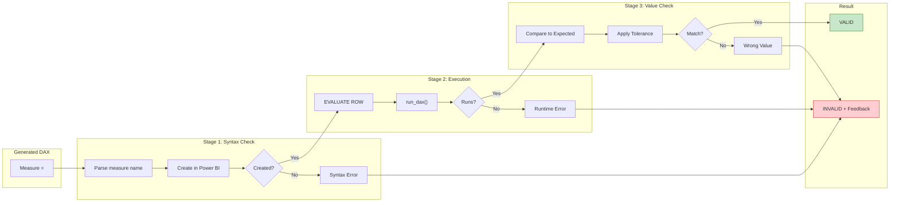
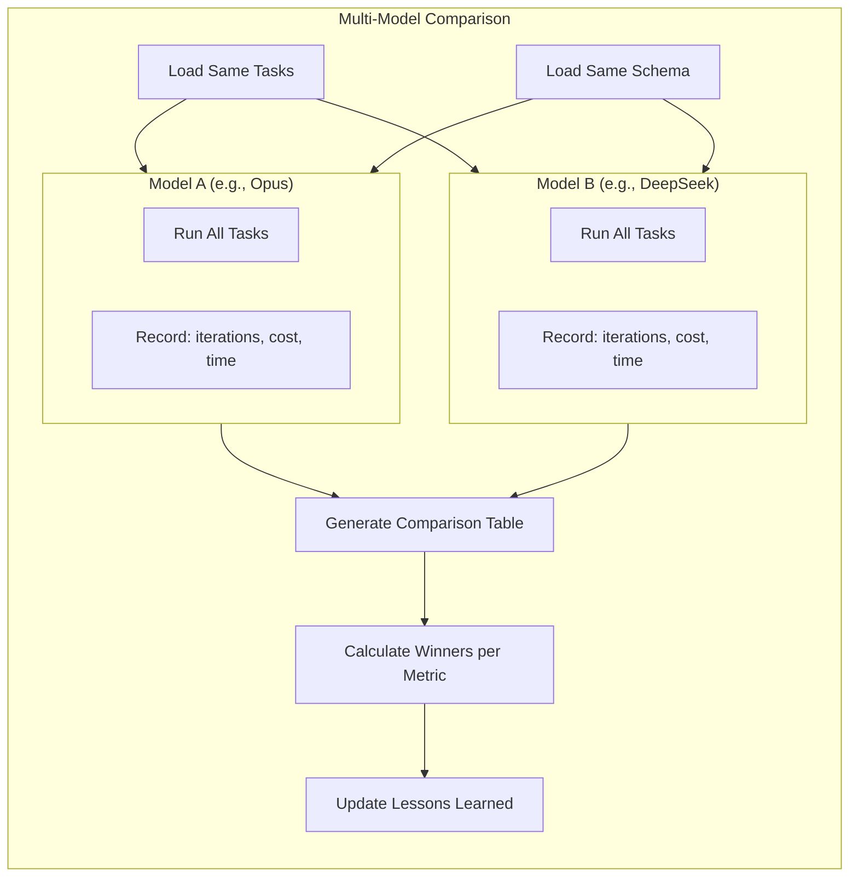

# DAX Bench Workflow

## Complete System Flowchart

```mermaid
flowchart TB
    subgraph INIT["INITIALIZATION PHASE"]
        direction TB
        I1[/"User: Run DAX Bench"/]
        I2["Step 1: Read Lessons Learned<br/>lessons-learned.md"]
        I3["Step 2: Refresh Model Cache<br/>fetch_models.py refresh"]
        I4{"Step 3: Update<br/>DAX Functions?"}
        I5["Fetch dax.guide/functions"]
        I6["Step 4: Verify Power BI<br/>MCP Connection"]
        I7{"Connected?"}
        I8["Step 5: Extract Live Schema<br/>Tables, Columns, Relationships"]
        I9["Step 6: Load Task Definitions<br/>tasks/*.json"]
        I10[["INIT COMPLETE"]]
        STOP1((("STOP:<br/>Open Power BI")))

        I1 --> I2 --> I3 --> I4
        I4 -->|Yes| I5 --> I6
        I4 -->|No| I6
        I6 --> I7
        I7 -->|No| STOP1
        I7 -->|Yes| I8 --> I9 --> I10
    end

    subgraph SELECT["MODEL & TASK SELECTION"]
        direction TB
        S1["Select Model(s) from Cache<br/>free | flash | strong | frontier"]
        S2["Select Task(s)<br/>basic | intermediate | advanced"]
        S3["Inject Live Schema into Prompts"]
    end

    subgraph SOLVE["SOLVE LOOP (per model, per task)"]
        direction TB
        L1["iteration = 0"]
        L2{"iteration <<br/>MAX_ITER?"}
        L3["iteration++"]
        L4["Call OpenRouter API<br/>model + system prompt + user prompt"]
        L5["Parse DAX from Response"]
        L6["Extract: measure_name, expression"]

        DONE((("Task<br/>SOLVED")))
        FAIL((("Task<br/>FAILED")))
    end

    subgraph VALIDATE["POWER BI VALIDATION (MCP)"]
        direction TB
        V1["Create Measure in Power BI<br/>manage_measure(create)"]
        V2{"Syntax<br/>Valid?"}
        V3["Execute Measure<br/>run_dax(EVALUATE ROW)"]
        V4{"Execution<br/>Succeeds?"}
        V5{"Has Expected<br/>Value?"}
        V6["Compare Result to Expected"]
        V7{"Values<br/>Match?"}
        V8["Generate Feedback:<br/>Syntax Error"]
        V9["Generate Feedback:<br/>Execution Error"]
        V10["Generate Feedback:<br/>Wrong Value"]
    end

    subgraph OUTPUT["RESULTS & LOGGING"]
        direction TB
        O1["Log Run Details<br/>runs/{timestamp}_{model}_{task}.md"]
        O2["Record Metrics:<br/>iterations, tokens, cost, time"]
        O3{"More<br/>Tasks?"}
        O4{"More<br/>Models?"}
        O5["Generate Comparison Report<br/>runs/{timestamp}_comparison.md"]
        O6["Update Lessons Learned<br/>lessons-learned.md"]
        O7[/"Display Summary Table"/]
    end

    %% Main Flow
    INIT --> SELECT
    I10 --> S1 --> S2 --> S3
    S3 --> SOLVE

    %% Solve Loop
    S3 --> L1 --> L2
    L2 -->|Yes| L3 --> L4 --> L5 --> L6
    L2 -->|No| FAIL

    %% Validation
    L6 --> V1 --> V2
    V2 -->|No| V8 --> L2
    V2 -->|Yes| V3 --> V4
    V4 -->|No| V9 --> L2
    V4 -->|Yes| V5
    V5 -->|No| DONE
    V5 -->|Yes| V6 --> V7
    V7 -->|No| V10 --> L2
    V7 -->|Yes| DONE

    %% Results
    DONE --> O1 --> O2 --> O3
    FAIL --> O1
    O3 -->|Yes| L1
    O3 -->|No| O4
    O4 -->|Yes| L1
    O4 -->|No| O5 --> O6 --> O7

    %% Styling
    classDef init fill:#e1f5fe,stroke:#01579b
    classDef select fill:#f3e5f5,stroke:#4a148c
    classDef solve fill:#fff3e0,stroke:#e65100
    classDef validate fill:#e8f5e9,stroke:#1b5e20
    classDef output fill:#fce4ec,stroke:#880e4f
    classDef success fill:#c8e6c9,stroke:#2e7d32
    classDef failure fill:#ffcdd2,stroke:#c62828
    classDef stop fill:#ffcdd2,stroke:#c62828

    class I1,I2,I3,I4,I5,I6,I7,I8,I9,I10 init
    class S1,S2,S3 select
    class L1,L2,L3,L4,L5,L6 solve
    class V1,V2,V3,V4,V5,V6,V7,V8,V9,V10 validate
    class O1,O2,O3,O4,O5,O6,O7 output
    class DONE success
    class FAIL,STOP1 failure
```



## Detailed Solve Loop

```mermaid
flowchart LR
    subgraph ITERATION["Single Iteration"]
        direction TB
        A["Build Prompt"] --> B["Call LLM API"]
        B --> C["Parse Response"]
        C --> D["Extract DAX"]
        D --> E["Validate in Power BI"]
        E --> F{"Valid?"}
        F -->|Yes| G["SOLVED"]
        F -->|No| H["Generate Feedback"]
        H --> I["Append to Context"]
        I --> A
    end

    subgraph PROMPT["Prompt Structure"]
        direction TB
        P1["System Prompt<br/>(DAX expert role)"]
        P2["Live Schema<br/>(from Power BI)"]
        P3["Task Description<br/>(from JSON)"]
        P4["Previous Attempts<br/>(if iteration > 1)"]
        P5["Feedback<br/>(error details)"]
    end

    subgraph FEEDBACK["Feedback Types"]
        direction TB
        F1["Syntax Error<br/>Missing parens, bad function"]
        F2["Execution Error<br/>Invalid reference, context issue"]
        F3["Wrong Value<br/>Logic error, off-by-one"]
        F4["Pattern Hint<br/>Use DIVIDE(), avoid EARLIER"]
    end

    PROMPT --> ITERATION
    FEEDBACK -.-> H
```



## Validation Pipeline



## Model Comparison Flow



## Key Metrics Tracked

| Metric | Description | Calculation |
|--------|-------------|-------------|
| **First-Try Success** | Tasks solved on iteration 1 | `count(iterations == 1) / total_tasks` |
| **Solve Rate** | Tasks eventually solved | `count(solved) / total_tasks` |
| **Avg Iterations** | Mean iterations to solve | `sum(iterations) / count(solved)` |
| **Total Cost** | API cost for all tasks | `sum(input_tokens * input_rate + output_tokens * output_rate)` |
| **Cost per Solve** | Efficiency metric | `total_cost / count(solved)` |
| **Total Time** | Wall-clock time | `sum(api_response_time)` |

## File Locations

```
BigfootDAX/
├── .claude/skills/
│   └── dax-bench-solver/
│       └── lessons-learned.md      # Historical patterns & learnings
│
└── dax-bench/
    ├── tasks/                      # Task definitions (JSON)
    │   ├── basic/
    │   ├── intermediate/
    │   └── advanced/
    ├── runs/                       # Run logs & reports
    ├── results/                    # JSON result files
    ├── models_cache.json           # OpenRouter model catalog
    ├── dax_functions_reference.json # Valid DAX functions
    ├── bigfoot_reference_values.json # BigfootDAX expected values
    └── *.py                        # Benchmark scripts
```
