# DAX Bench v4 Validation Flow

## Overview

This document describes the complete testing and validation workflow for DAX Bench v4, which uses **mandatory Power BI execution validation** instead of pattern matching.

## Flow Diagram

## Validation Decision Tree

```mermaid
flowchart LR
    subgraph Input["Model Output"]
        A[Generated DAX]
    end

    subgraph Parse["Parse"]
        A --> B{Can Parse<br/>Name = Expr?}
        B -->|No| C[❌ Parse Error]
        B -->|Yes| D[Measure Name<br/>Expression]
    end

    subgraph CreateMeasure["Create in Power BI"]
        D --> E[manage_measure<br/>operation: create]
        E --> F{Success?}
        F -->|No| G[❌ Syntax Error]
        F -->|Yes| H[Measure Created]
    end

    subgraph Execute["Execute"]
        H --> I[run_dax<br/>EVALUATE ROW]
        I --> J{Returns<br/>Value?}
        J -->|No| K[❌ Execution Error]
        J -->|Yes| L[✅ VALID]
    end

    subgraph Feedback["On Failure"]
        C --> M[Generate Feedback]
        G --> M
        K --> M
        M --> N[Next Iteration]
    end

    style L fill:#c8e6c9
    style C fill:#ffcdd2
    style G fill:#ffcdd2
    style K fill:#ffcdd2
```

## Iteration Feedback Flow

## Component Architecture

## Key Files

| File | Purpose |
|------|---------|
| `run_benchmark_v4.py` | CLI entry point with task selection |
| `benchmark_mcp.py` | Core functions for MCP integration |
| `tasks/{level}/task-XXX.json` | Task definitions |
| `runs/YYYY-MM-DD_*_v4.md` | Individual task logs |
| `runs/YYYY-MM-DD_SUMMARY_*_v4.md` | Benchmark summary |

## Validation Guarantees

1. **Syntax Validity**: If measure creation succeeds, DAX syntax is valid
2. **Execution Validity**: If EVALUATE ROW returns a value, the measure executes
3. **No False Positives**: Pattern matching removed - only real execution counts
4. **Iteration Learning**: Models get specific error feedback to improve
